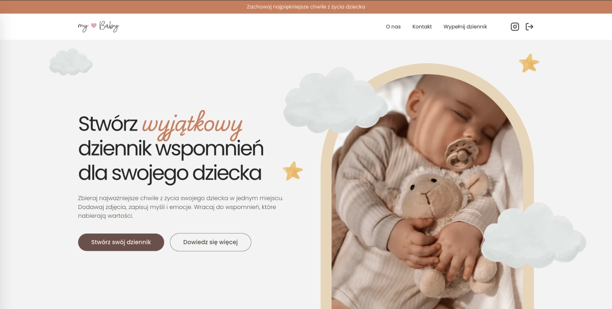
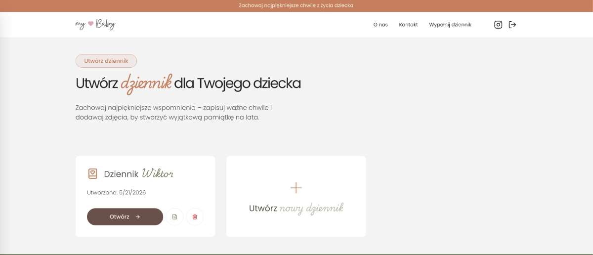
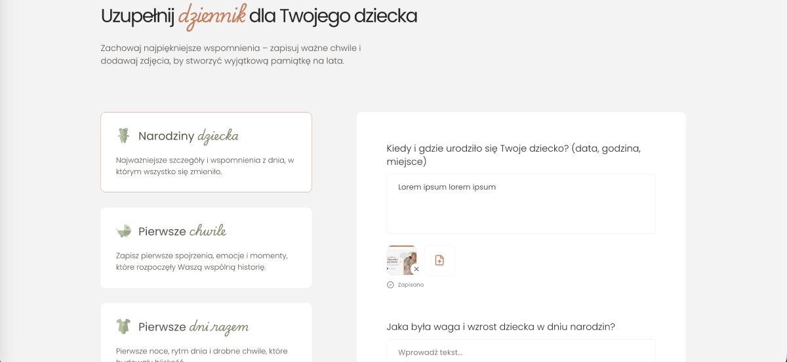

# My Baby — Full-Stack Web App

Aplikacja webowa do tworzenia cyfrowych dzienników wspomnień dla dzieci. Rodzic zakłada konto, tworzy dziennik, uzupełnia wpisy tekstowe i zdjęcia w kategoriach tematycznych, a na końcu generuje gotowy plik PDF.

## Zrzuty ekranu

### Strona główna



### Lista dzienników



### Wpis w dzienniku




---

## Stack technologiczny

| Warstwa | Technologie |
|---------|-------------|
| **Framework** | Next.js 15 (App Router), React 19, TypeScript |
| **Styling** | Tailwind CSS 4, Radix UI, shadcn/ui |
| **Backend** | Server Actions, Route Handlers, Middleware |
| **Baza danych** | PostgreSQL, Prisma ORM |
| **Auth** | JWT (`jose`), httpOnly cookies, bcrypt |
| **Storage** | Vercel Blob, Sharp (resize/kompresja) |
| **PDF** | `@react-pdf/renderer` (streaming), `pdf-lib` |
| **E-mail** | Resend (reset hasła, formularz kontaktowy) |
| **Deploy** | Vercel |

---

## Architektura

Aplikacja oparta jest na **Next.js App Router** z podziałem na Server Components (fetch danych, SEO) i Client Components (interaktywność, auto-save, formularze).

### Routing i warstwa prezentacji

- **App Router** — strony marketingowe (`/`, `/o-nas`, `/kontakt`) + strefa chroniona (`/dziennik/*`)
- **Server Components** — pobieranie danych dziennika po stronie serwera (`getDiaryById`), metadata SEO per route
- **Client Components** — edycja wpisów, upload zdjęć, formularze `useActionState`
- **Middleware** — redirect niezalogowanych użytkowników z `/dziennik/*` na `/logowanie`

### Autentykacja i sesje

- Hasła hashowane **bcrypt** 
- Sesja w **httpOnly cookie** (`secure`, `sameSite: lax`)
- Token JWT (HS256) generowany przez **jose** — czas życia 3h
- **Sliding session** — token odświeżany automatycznie, gdy zostało < 1h do wygaśnięcia
- Reset hasła: token kryptograficzny (`crypto.randomBytes`), expiry 1h, link wysyłany przez Resend
- Każda Server Action weryfikuje sesję przez `verifySession()` — brak dostępu do cudzych dzienników (filtrowanie po `userId`)

### Warstwa danych (Prisma)

Relacyjny model z kaskadowym usuwaniem:

```
User → Diary → DiaryEntry → DiaryEntryFile
```

### Auto-save wpisów

Edycja tekstu w dzienniku działa bez przycisku „Zapisz”:

1. `useDebounce` (1s) opóźnia zapis
2. Server Action `saveEntry` wykonuje upsert w bazie
3. UI pokazuje stany: `saving` → `saved` / `error`

### Upload i przetwarzanie zdjęć

Pipeline po stronie serwera (`uploadImageToBlob`):

1. Weryfikacja sesji
2. Resize do 200×200 px przez **Sharp** (cover, center crop)
3. Konwersja do PNG
4. Upload do **Vercel Blob** (public access)
5. URL zapisany w `DiaryEntryFile`
6. Przy usuwaniu wpisu — cleanup plików z Blob storage

Limit rozmiaru requestu Server Actions: **10 MB** (konfiguracja w `next.config.ts`).

### Generowanie PDF

Endpoint `GET /api/generate-pdf/[id]`:

1. Weryfikacja sesji i ownership dziennika
2. Mapowanie wpisów na kategorie pytań (tylko kategorie z odpowiedziami)
3. Osadzenie dekoracji i ikon jako base64 data URLs
4. Render komponentu React → PDF przez `@react-pdf/renderer` (`renderToStream`)
5. Streaming odpowiedzi jako `application/pdf` z nagłówkiem `Content-Disposition: attachment`

### Formularze i walidacja

- **React 19 `useActionState`** — deklaratywne formularze z Server Actions (login, rejestracja, reset hasła, tworzenie dziennika, kontakt)
- Walidacja po stronie serwera z typed error states (`AuthActionState`, `ResetPasswordActionState`)
- Toast notifications przez **Sonner**

---

## Struktura repozytorium

```
src/
├── app/                    # Routing (App Router), API routes, layout
│   ├── (auth)/             # Logowanie, rejestracja, reset hasła
│   ├── dziennik/           # Lista dzienników + edycja wpisów
│   └── api/generate-pdf/   # Eksport PDF
├── components/
│   ├── Auth/               # Formularze auth (useActionState)
│   ├── Diary/              # Edycja dziennika, auto-save, upload zdjęć
│   ├── PdfDiary/           # Layout PDF (react-pdf)
│   └── ui/                 # Komponenty shadcn/ui
├── lib/
│   ├── questions.ts        # Kategorie i pytania dziennika (config)
│   ├── hooks.ts            # useDebounce
│   └── types.ts            # Typy TS współdzielone front/back
└── server/
    ├── auth.ts             # signIn, signUp, signOut
    ├── session.ts          # JWT encrypt/decrypt, cookie management
    ├── diary.ts            # CRUD dziennika i wpisów
    ├── images.ts           # Upload/delete w Vercel Blob
    ├── resetPassword.ts    # Flow resetowania hasła
    └── sendMail.ts         # Formularz kontaktowy
prisma/
└── schema.prisma           # User, Diary, DiaryEntry, DiaryEntryFile
```

---

## Uruchomienie lokalne

```bash
npm install
npx prisma migrate dev
npm run dev
```

Aplikacja: [http://localhost:3000](http://localhost:3000)

### Wymagane zmienne środowiskowe

```env
DATABASE_URL="postgresql://..."
JWT_SECRET="..."
NEXT_PUBLIC_URL="http://localhost:3000"
RESEND_API_KEY="re_..."
RESEND_FROM_EMAIL="..."
RESEND_TO_EMAIL="..."
BLOB_READ_WRITE_TOKEN="vercel_blob_..."
```

### Skrypty

```bash
npm run dev      # dev server
npm run build    # production build
npm run start    # production server
npm run lint     # ESLint
```

---

## Licencja

Projekt prywatny — portfolio / demonstracja umiejętności.
